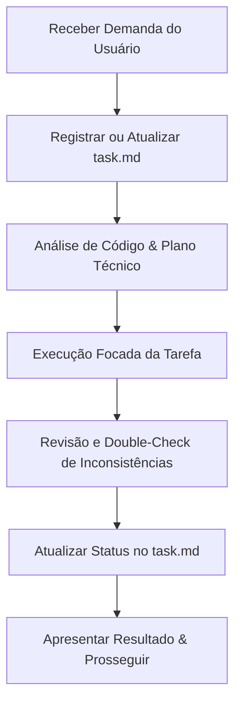

# Protocolo de Habilidade de Desenvolvimento Baseado em Tasks

Este protocolo define a habilidade operacional obrigatória para a execução de tarefas no projeto **CRM Vendas DeNigris**. Toda interação e desenvolvimento devem seguir rigorosamente o ciclo de vida estruturado abaixo.

---

## 🌀 Ciclo de Vida do Desenvolvimento (Passo a Passo)

---

## 🛠️ Detalhamento das Etapas

### 1. Registro de Demanda (Tasking)
*   **Ação:** Logo após o recebimento de qualquer instrução, bug report ou nova feature solicitada pelo usuário, a IA deve registrar ou atualizar o arquivo `task.md` na raiz do projeto.
*   **Regra Rígida:** Nenhuma linha de código de produção deve ser alterada antes da atualização do `task.md`.

### 2. Análise de Código e Plano Técnico (Zero Regressão)
*   **Ação:** Analisar detalhadamente o código atual e criar um plano de implementação.
*   **Foco:** Garantir que a alteração seja feita de forma limpa, de acordo com as regras de negócio pré-existentes, sem causar regressões funcionais ou quebrar compilações.

### 3. Execução Focada
*   **Ação:** Aplicar as alterações técnicas no código seguindo as melhores práticas (tipagem TypeScript estrita, segurança FastAPI, tratamento de erros robusto).

### 4. Code Review & Double-Check
*   **Ação:** Após a execução, realizar uma varredura crítica no código modificado.
*   **Foco:** Procurar por loops ineficientes, try-catch silenciosos, tipagens inconsistentes ou imports ausentes.

### 5. Atualização de Progresso
*   **Ação:** Atualizar o arquivo `task.md`, marcando a tarefa concluída com a data e observações técnicas relevantes antes de seguir para o próximo item.

### 6. Protocolo de Pré-Commit e Revisão
*   **Regra de Ouro:** Sempre antes de fazer qualquer `git commit`, você deve obrigatoriamente fazer uma revisão sistemática procurando erros que possa ter cometido ou itens que tenha esquecido de fazer.
*   **Checklist de Validação:** Use o arquivo `task.md` como a base definitiva para este checklist. O `task.md` deve ser atualizado com as novas tarefas antes do início do desenvolvimento e atualizado novamente marcando-as como concluídas logo após o término, servindo como auditoria final pré-commit.

### 7. Uso e Atualização do Mapa do Projeto
*   **Ação:** Antes de planejar qualquer alteração técnica ou responder a dúvidas arquiteturais, consulte o arquivo `mapa_projeto.md` como o guia de referência rápido do ecossistema do projeto.
*   **Regra de Sincronização:** Sempre que realizar modificações de impacto estrutural no código (ex: adicionar colunas a tabelas, criar endpoints de rotas, introduzir novas telas do frontend ou alterar variáveis críticas), atualize imediatamente o arquivo `mapa_projeto.md` na mesma proporção das modificações efetuadas.
